## Project Title - COVID-19 Research ETL

### Project Description
This project's goal is to apply the acquired ETL (extract, transform, load) learnings in class to a topic of our choice. 
Our group has decided to focus this project on the major topic of the moment - Corona Virus / Covid-19.

### Project Team -Pandas in Pandemic
- Kendall Marquard
- Smiti Swain
- Luis Ramirez
- Salvador Neves
- Tejas Naik

### ETL:

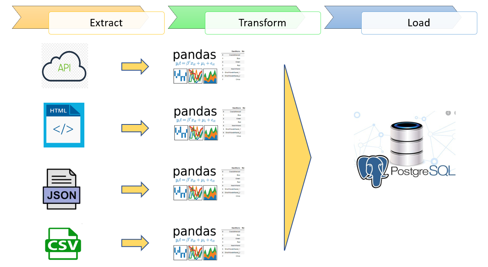

<ins>**Country Table**</ins> 
#### Data Extraction:
The data source is a json file from https://worldpopulationreview.com/

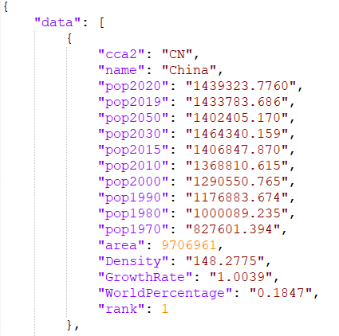

1) Json library was used to handle the file.
2) We looped through the json to append the values to arrays previously created. 
3) From there we created a Data Frame.

#### Data Transformation:
1) Selected only the necessary fields from json file.
2) Renamed fields while storing in Data Frame
3) Set Country ID as index.

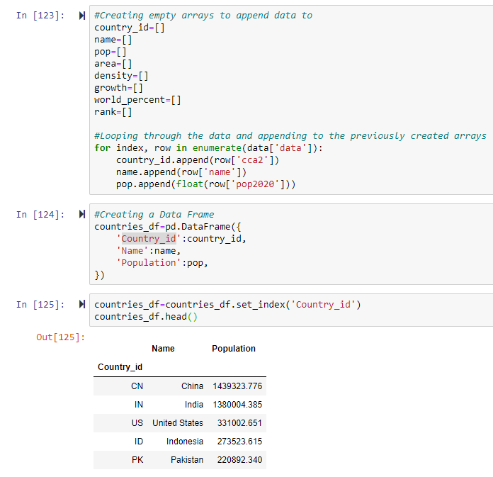

<ins>**State Table**</ins> 
#### Data Extraction:
The data source is wikipedia. https://en.wikipedia.org/wiki/List_of_states_and_territories_of_the_United_States_by_population

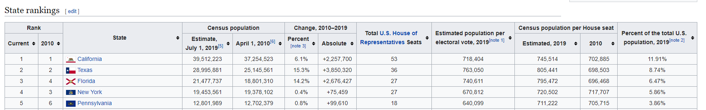

1) Pandas scraping (pandas.read_html) was used.
2) The table information sourced directly from the website was stored in a Data Frame.

#### Data Transformation:
1) The table scraped from Wikipedia had two levels of column headers so we dropped the top one.
2) Dropped columns that we don't need in the data frame.
3) Renamed columns to friendly names.
4) Used a dictionary with state abreviations and names, converted it to a dataframe.
5) Merged the state and name Data Frame with the previous data frame to add abreviations to the State Table.

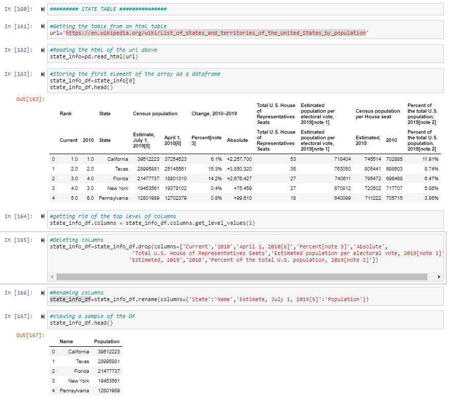

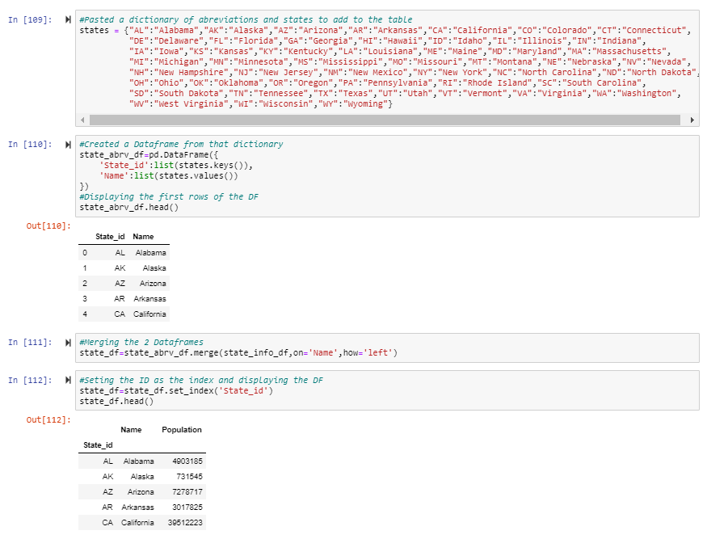

<ins>**Country_Cases Table**</ins> 
#### Data Extraction:

The data source is a CSV file.Using Padas read_csv,data was imported from the CSV to display as data frame.

#### Data Transformation:

1) For the Country_Case Table we had a small issue with the API which was that for some Countries the level of information was down to the city. So in order to fix this issue, we have use an aggregator function, we grouped by Country and date and got the sum of the confirmed, deaths, recovered and active cases.
2) Converted the timestamp returned by the API to a Date format.
3) Set CountryID and Date as the index.

<< insert some code snippets >>

<ins>**US_States_Cases Table**</ins> 
#### Data Extraction:
The data source is an API end point https://covidtracking.com/api/v1/states/daily.json

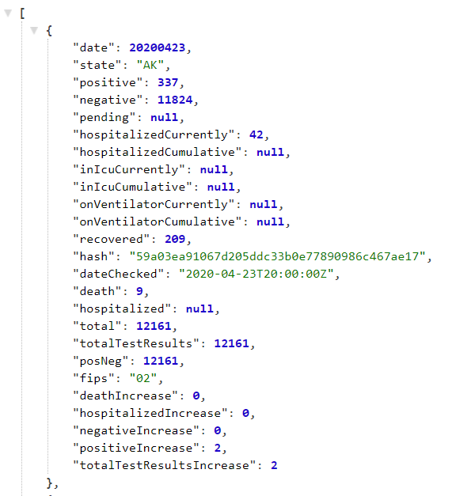

1) Using Requests module, response was received from the API endpoint.
2) Using JSON traversal, desired datapoints were collected and stored in lists.
3) The data retrived was then stored in a Data Frame.

#### Data Transformation:
1) For the US_States_Cases Table the json data returned from API was not consistent . For example , if for a day there are no positive cases , the json data did not have the key altogether. In order to fix this issue, try - except code bloack was used, when the key is now fund, and store the value as "0".
2) Converted the date returned by the API from string to Date format.

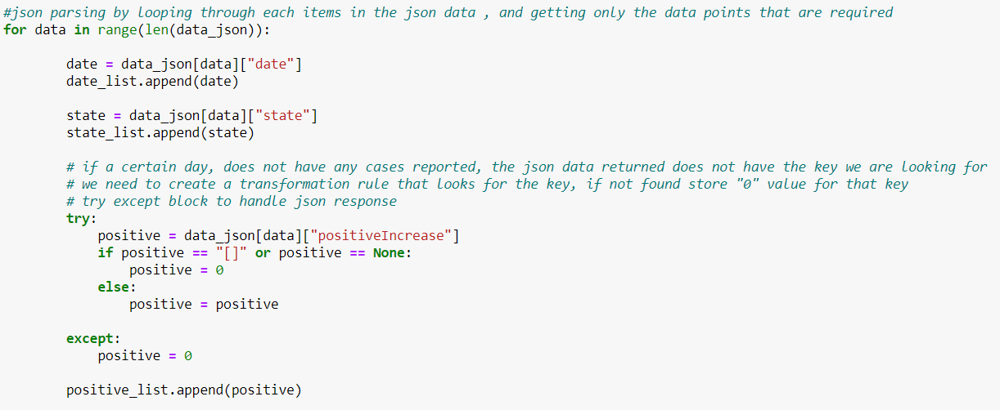
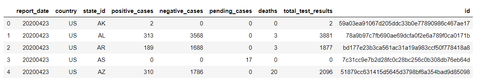

<ins>**Index_prices Table**</ins> 
#### Data Extraction:
The data source is "yfinance" module, which is a python library that scrapes data from Yahoo! Finance and returns the data in a DataFrame format to get free stock market data.

1) We needed to pip install yfinance.
2) We created a dictionary to hold the ticker and country code for major world indices.
2) Using a For loop , and the yfinance module, data was received for each of the ticker passed from the previously cretaed dictionary.

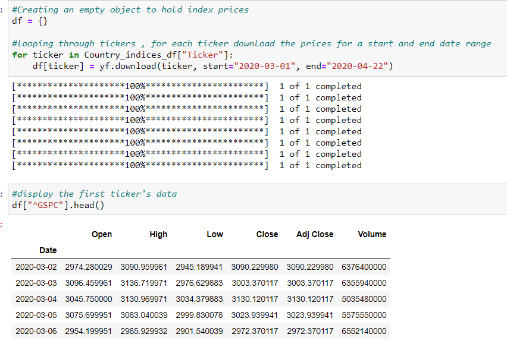

#### Data Transformation:
1) Data Frame returned from yfinance module did not have the Index Ticker, name and County. Using a dictionary converted dataframe and  a for loop to iterate through the dataframe , new columns were added to the main Data Frames. 
2) Reset Index on the Data Frame, that previously had Date as the index.

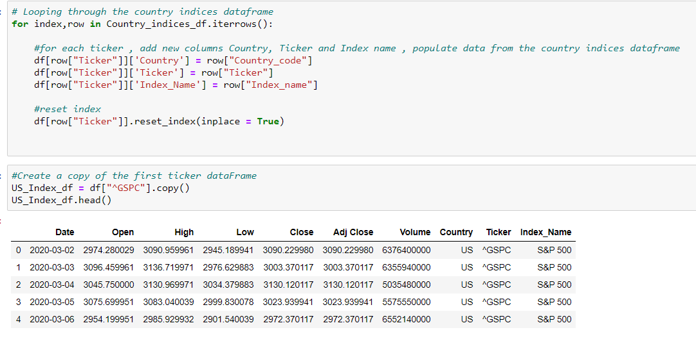

<ins>**Hospital Beds**</ins> 
#### Data Extraction:

1)	Panda’s read_CSV to read csv file form Kaggle data set.
2)	CSV was downloaded direct to resource folder and used. 

#### Data Transformation:
1)	After loading CSV to data frame reduced data frame for data of interest.
2)	Data frame was further filtered for US and US state to keep data limited to US.
3)	Used aggregation/grouped by function and to convert bed per 1000 population by states.

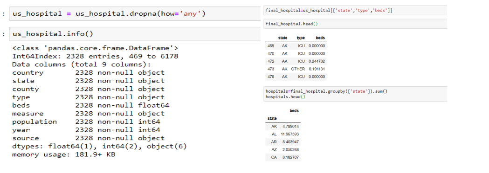

<ins>**Gas_Price table**</ins> 
### Data Extraction: 
The data source is https://www.eia.gov/petroleum/data.php which is U.S. Energy Information Administration. This website provided us with several cvs files. 

#### Data Transformation:
1) Downloaded the cvs files. 
3) Imported the cvs files to jupyter notebook.
2) Merged the data sets oil production and stock by date.
3) Isolated the coloumns that we are measuring and saving them to a new variable.
4) Renaming the old titles into clear names.
5) Imported a second csv file for retail price of oil, filter the table to only show the states, rename the titles and save them to a new table.

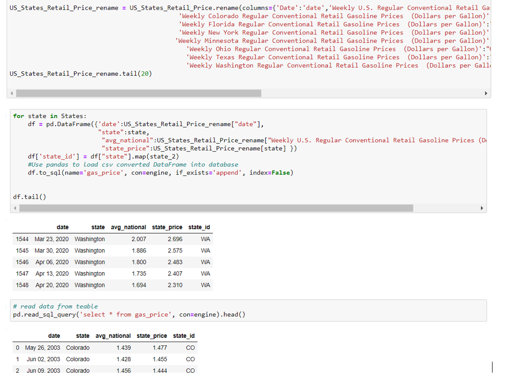

<ins>**US_Unemployment_Stats Table**</ins> 
### Data Extraction: 
The data source we used was https://www.bls.gov/web/laus/lauhsthl.htm , which came from the U.S. Bureau of Labor Statistics. This website provided us with a HTML file. 

#### Data Transformation:
1) Import the HTML file on Jupyter notebook and print the table to understand how the data is formatted. 
2) Isolate and identify the columns that we are measuring and create a new dataframe with this data.
3) Dropped unwanted rows.
4) Mapped the State name with a dictionary of state name and abbreviation , to get the abbreviation and store it in a new State ID column.
5) Renaming the old titles into names that are cohesive with other data sets.
6) Create a new table with this data.

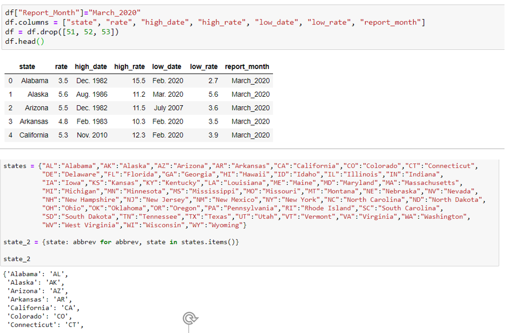
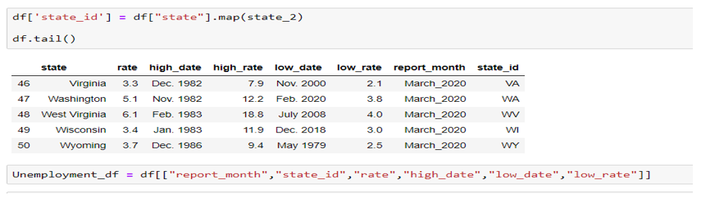

### Data Load:

1) Created tables in postgres database.
2) Using sqlalchemy create-engine , connection was set up with the postgres database.
3) Using pandas to_sql(), data was inserted into the tables.

